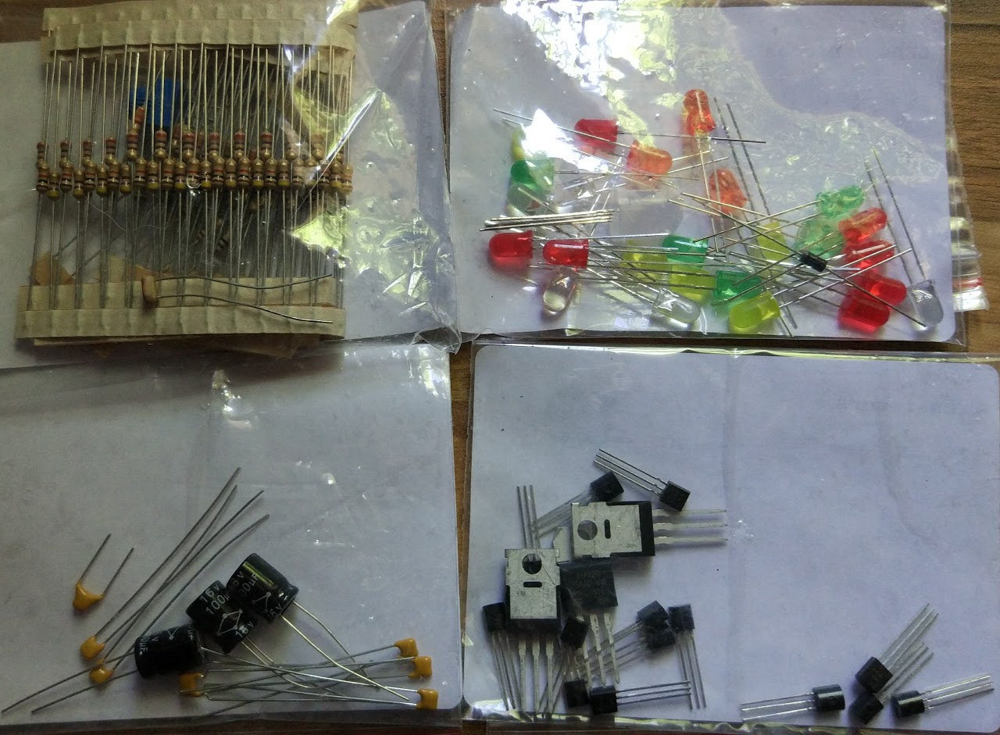
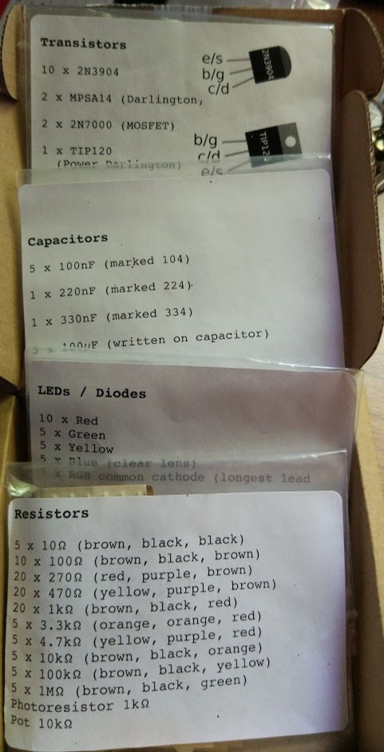

# [Kit componentes](https://www.monkmakes.com/basic_comp_pack/)

Disponible en [Amazon](https://www.amazon.co.uk/d/49r/Monk-Makes-Ltd-SKU00050-Basic-Component-Kit/B01EREYOEW) por £9,9 (unos 11€ al cambio  )

Incluye
* 100 resistencias de distintos valores
* 1 potenciómetro
* 1 LDR
* 10 condensadores
* 17 transistores, de diferentes tipos (Darlington, Mosfet, ...)  
* 27 LEDs (de distintos colores y RGB) y diodos.

Los componentes vienen organizados en bolsas y con los valores perfectamente indicados

## Opinión

Me parece un kit muy interesante que por un precio ajustado nos proporciona los componentes y la información para usarlos
