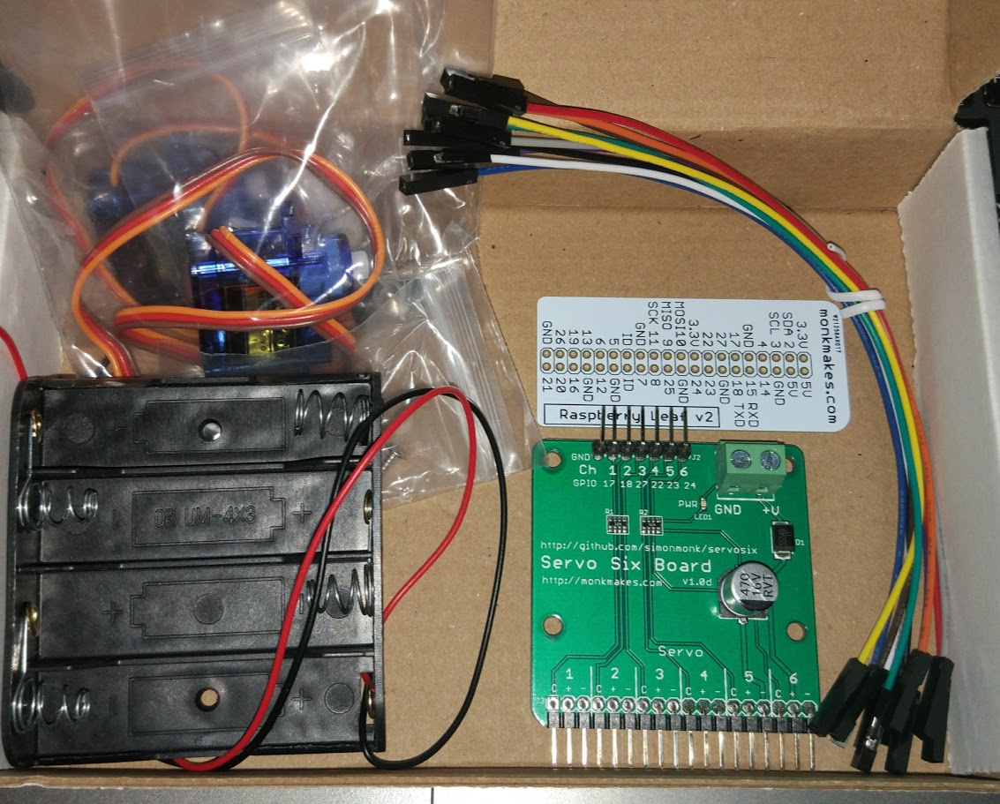

# [Kit para controlar 6 Servos con Raspberry Pi](http://www.monkmakes.com/servosix/)

Se trata de un kit que incluye una placa que facilita el control de 6 servos con la Raspberry Pi

Incluye

* Placa de control de 6 servos
* 2 Servos 9g
* Placa para identificación de los pines de Raspbery
* Portabaterías de 4 pilas AA
* 10 Cables de conexión

Se puede descargar el código de ejemplo de la cuenta de [github de Simon Monk](https://github.com/simonmonk/servosix)

## Mejoras

* Indicar para qué modelos de Rasperry Pi es válida la placa de identificación de pines
