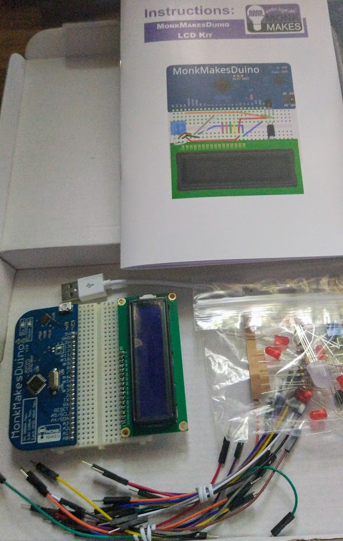
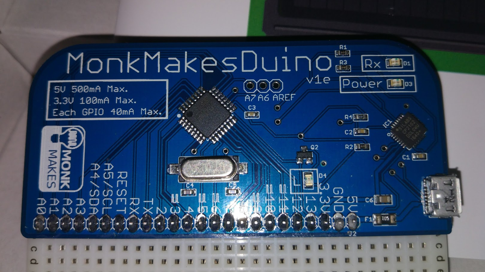
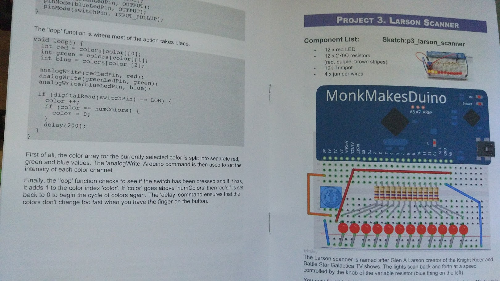

# Kit de inciación con LCD MonkMakesDuino

Se trata de un kit de iniciación con los típicos componentes para empezar con Arduino y un LCD

Incluye una placa compatible con Arduino UNO llamada [MonkMakesDuino](http://www.monkmakes.com/mmd/), con un formato muy cómodo para trabajar con la placa de protipo.

Los pines están perfectamente indicados y la serigrafía ya nos da mucha información sobre la placa, por ejemplo las intensidades máximas de cada pin.

La placa incluye 8 entradas analógicas + 14 entradas/salidas digitales

El kit incluye:
* Placa compatible Arduino UNO
* Placa de prototipo
* Cable USB
* 12 leds rojos (y sus 12 resistencias de 270ohmios)
* 2 pulsadores
* Sensor de temperatura TMP36
* LCD 16x2
* 20 cables de conexión
* LED RGB
* Condensador Electrólítico
* Potenciómetro de 10k
* LDR
* Buzzer
* Libro de 32 páginas con todo lo necesario para hacer 7 proyectos que aprovechan los componentes del kit

Los ejemplos y los diagramas de los montajes están disponibles en [github](https://github.com/simonmonk/mmduino_lcd_kit)

## Opinión

Me parece un kit muy interesante, con los suficientes componentes para introducirse perfectamente el mundo de Arduino. El libro que se incluye le da un valor extra para personas que están comenzando, facilitándoles enormemente el aprendizaje.

## Mejoras

* Hubiera incluido los pines A6 y A7 (y Aref) en la parte frontal con el resto de pines
* Incluir un servo 9g entre los componentes
* En la descripción de "qué es una breadboard" incluiría una imagen (similar a [esta](https://ingenieriaelectronica.org/wp-content/uploads/2015/08/Representaci%C3%B3n-de-una-coneccion-en-un-protoboard.gif))
* En el Larsson Scanner no usaría array, podemos hacerlo iterando directamente en los pines 2 al 13
* ¿Se puede descargar el PDF del las instrucciones?
