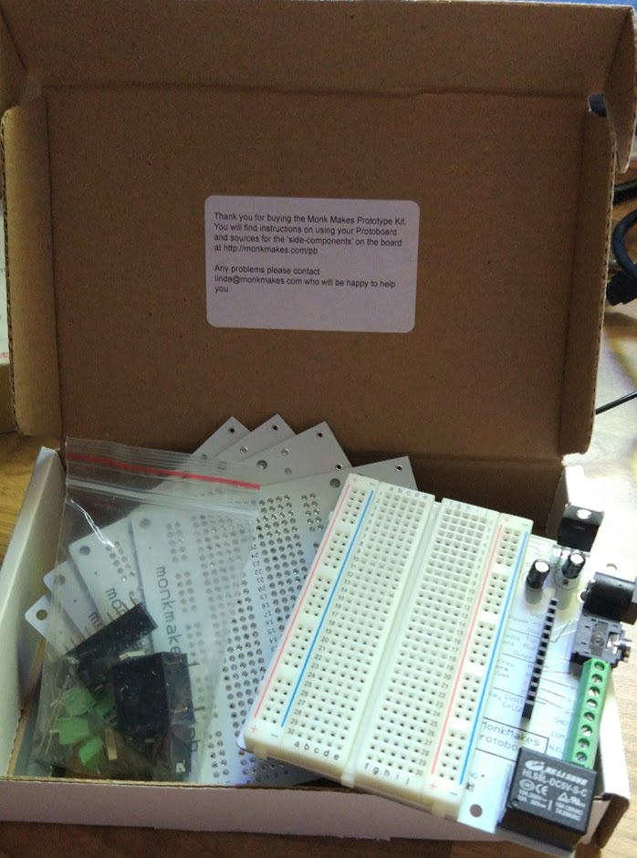

# [Protoboard Kit](https://www.monkmakes.com/pb/)

Se trata de un kit que pensado para facilitar el desarrollo de prototipos, proporcionado alimentación, conectores para cables más gruesos (y con clemas de tornillo) y hasta un relé.

Se incluyen 5 pcbs, una placa de prototipo y 2 kit de componentes (Relé, regulador lineal de 5V, condensadores y diversos conectores)

Está pensado para trabajar con la placa breadboard y luego poder pasarlo de manera muy sencilla a un acabado más definitivo soldando los componentes.

Se puede comprar en [Amazón](https://www.amazon.com/gp/product/B01MYN7ZZM?ie=UTF8&tag=monkmakes-20) por 29.95$

## Opinión

Me parece un kit muy interesante que nos facilita enormemente el trabajo de pasar un proyecto a un formato más definitivo.

## Mejoras

Incluiría un transistor (y quizás un diodo) para controlar el relé, pienso que sería más seguro
