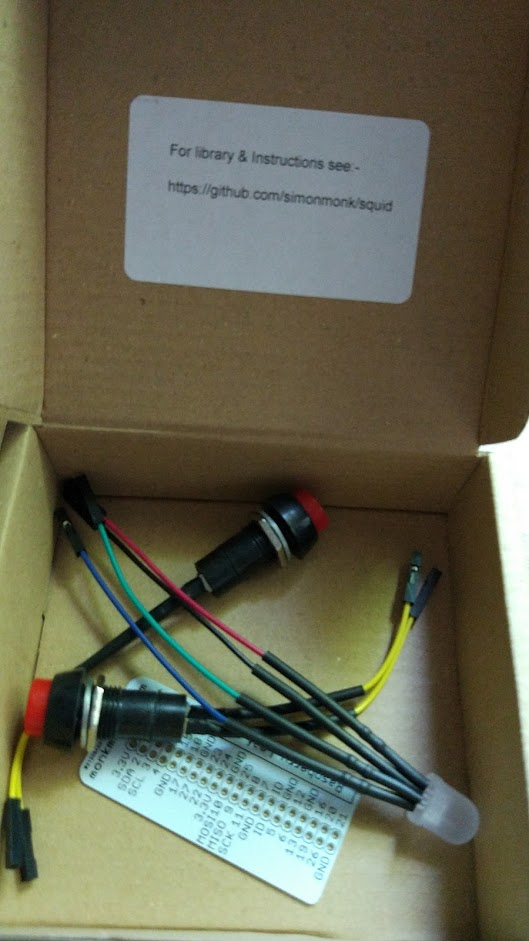

# Raspberry Squid Combo Pack

Se trata de un componentes que nos facilitan la conexión de componentes como son un led RGB y 2 pulsadores a una Raspberry. Además se incluye una placa que nos indica los pines de forma muy sencilla.

Se puede comprar en [Amazon](https://www.amazon.com/gp/product/B0170AJ98G) por 14.95$

[Ejemplo de uso](https://github.com/simonmonk/squid)

## Opinión

Es una forma excelente y sencilla de iniciarse en la electrónica con Raspberry, pero veo el precio algo alto.
